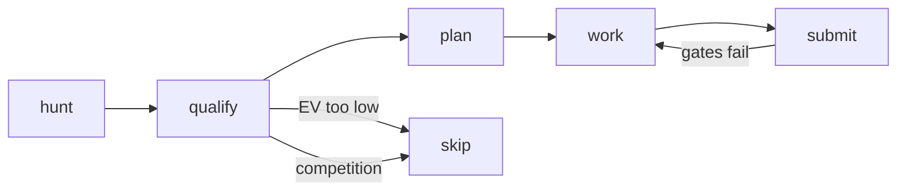
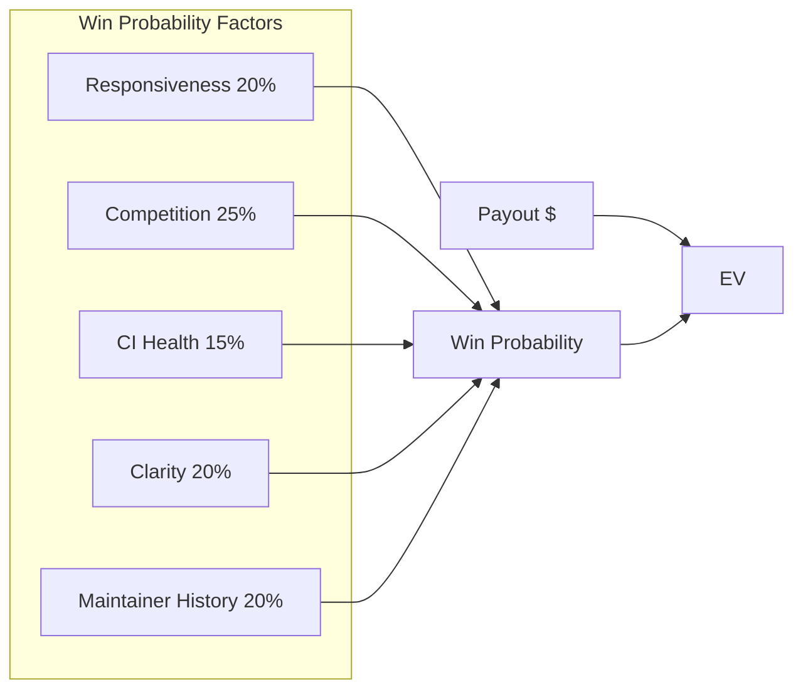
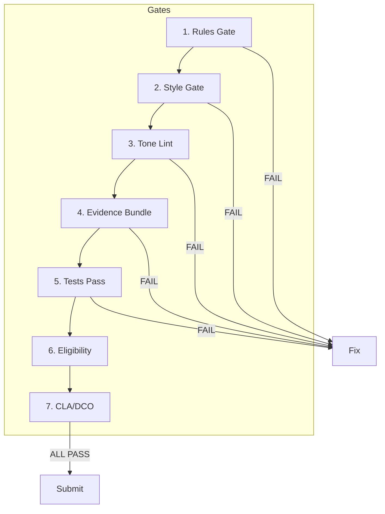
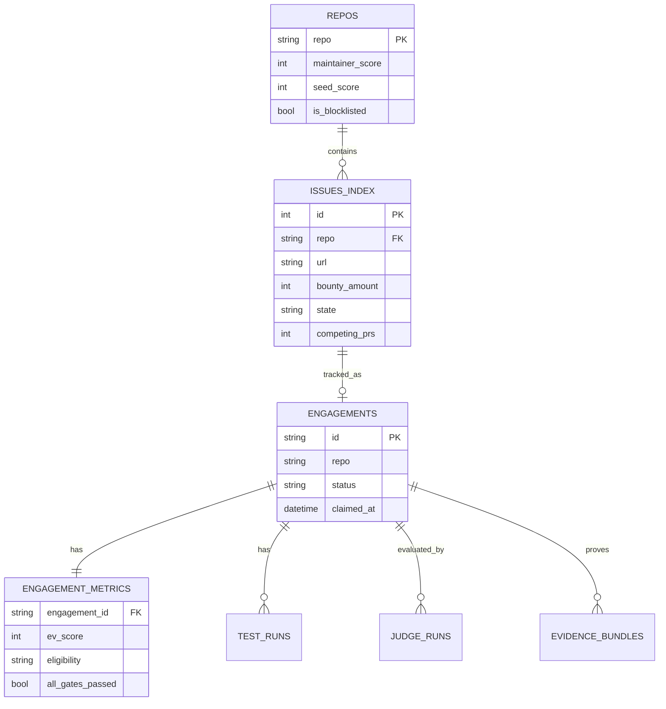

# bounty-system

CLI for systematic bounty hunting with quality gates.

## The Problem

Open source bounty hunting is broken:

1. **AI slop contributions** - Maintainers are drowning in low-quality AI-generated PRs. Your well-researched fix gets lost in a pile of ChatGPT copy-paste jobs.

2. **Wasted effort** - You spend 4 hours on a bounty, submit a PR, then discover 5 people submitted the same fix yesterday. Or the maintainer hasn't merged anything in 6 months.

3. **No proof of work** - When a maintainer asks "did you actually understand this codebase or just throw AI at it?", you have nothing to show.

4. **Bad ROI** - Some bounties look good on paper but have hostile maintainers, broken CI, unclear requirements, or hidden complexity. You find out after wasting a weekend.

## How It Works



**hunt** - Find opportunities with EV scoring and competition detection
**qualify** - Verify issue is workable, no competing PRs, maintainer is responsive
**plan** - Read CONTRIBUTING.md, understand requirements, estimate effort
**work** - Record your session, build evidence bundle
**submit** - Pass all quality gates, then post to GitHub

## Installation

```bash
# Clone and install
cd bounty-system
pnpm install
pnpm build

# Initialize database
bounty db init

# Configure GitHub token
bounty config set githubToken <your-token>
```

Requires: Node.js 20+, pnpm, GitHub CLI (`gh`) for validation

## Quick Start

```bash
# 1. Seed repos to track
bounty seed repos

# 2. Hunt for opportunities
bounty hunt --paid               # Find paid bounties
bounty hunt --rep                # Find reputation opportunities

# 3. Qualify before starting work
bounty qualify https://github.com/owner/repo/issues/123

# 4. Start work with recording
bounty work start <engagement-id>

# 5. Pass gates and submit
bounty judge run <engagement-id>
bounty submit <engagement-id>
```

## Core Concepts

### EV Scoring

Every bounty is scored before you start work:

```
EV = Payout x Win Probability
```



**Factors that increase your score:**
- High bounty value ($100+ gets bonus)
- Recent activity (updated in last 7 days)
- Known repo (you've contributed before)
- Preferred tech stack (configured in scoring config)
- Fast maintainer response time (TTFG < 15 min)

**Factors that decrease your score:**
- Competing PRs already submitted
- Stale issue (> 60 days old)
- Unfamiliar technology
- Slow maintainer (TTFG > 60 min)
- Blocklisted repo (bad experiences)

### Competition Detection

Before you start work, `bounty hunt` checks GitHub for:
- Existing PRs referencing the issue
- Other claimants who commented
- Issue state (still open?)

```bash
bounty hunt --validate           # Live GitHub checks (default ON)
bounty hunt --no-validate        # Skip for speed
bounty competition check <url>   # Detailed competition analysis
```

### Quality Gates

Seven gates must pass before submission:



| Gate | What It Checks |
|------|----------------|
| Rules | CONTRIBUTING.md loaded and acknowledged |
| Style | Project style guide analyzed and applied |
| Tone Lint | No AI-ish patterns in your PR description |
| Evidence | Session recording, test output, screenshots |
| Tests | All tests pass locally |
| Eligibility | Issue still workable, no blockers |
| CLA/DCO | Contributor agreement signed if required |

```bash
bounty judge run <engagement-id>  # Run all gates
bounty judge history <id>         # View past runs
```

### Tone Lint

Detects and flags AI-generated patterns in your text:

- Overused phrases ("I'd be happy to", "Let me help you")
- Excessive hedging ("I think", "I believe", "perhaps")
- Robotic structure (bullet points where prose is better)
- Generic opening/closing ("Great question!", "Hope this helps!")

```bash
bounty text lint "Your PR description here"
bounty text rewrite "Your text" --style conversational
```

### Evidence Bundles

Prove your work with recorded artifacts:

```bash
bounty work start <id>         # Start asciinema recording
bounty work checkpoint "msg"   # Add progress marker
bounty work stop               # End session, upload to GCS

bounty evidence build <id>     # Create evidence bundle
```

Bundle contains:
- `SUMMARY.md` - What you did and why
- `TESTING.md` - Test commands and output
- `RULES-COMPLIANCE.md` - How you followed project guidelines
- Terminal recording (asciinema cast)

## Commands

### Discovery

| Command | Description |
|---------|-------------|
| `bounty hunt` | Search indexed issues for opportunities |
| `bounty hunt --paid` | Only paid bounties |
| `bounty hunt --rep` | Only reputation opportunities |
| `bounty hunt --max-age 30` | Issues updated in last 30 days |
| `bounty seed repos` | Add repos to track |
| `bounty source add` | Add custom data source |
| `bounty ingest --all` | Refresh all sources |

### Evaluation

| Command | Description |
|---------|-------------|
| `bounty qualify <url>` | Full qualification of an issue |
| `bounty score url <url>` | Quick EV score |
| `bounty score discover` | Batch score multiple issues |
| `bounty competition check <url>` | Detailed competition analysis |
| `bounty maintainer show <repo>` | Maintainer responsiveness stats |

### Workflow

| Command | Description |
|---------|-------------|
| `bounty claim <id>` | Mark as claimed |
| `bounty plan <id>` | Create work plan |
| `bounty work start <id>` | Begin recorded session |
| `bounty work checkpoint` | Mark progress |
| `bounty work stop` | End session |
| `bounty draft <id>` | Draft PR content |
| `bounty submit <id>` | Submit after gates pass |
| `bounty abort <id>` | Abandon with reason |

### Quality Gates

| Command | Description |
|---------|-------------|
| `bounty rules fetch <repo>` | Fetch CONTRIBUTING.md |
| `bounty rules acknowledge <repo>` | Mark rules as read |
| `bounty style fetch <repo>` | Analyze project style |
| `bounty test run <id>` | Run and record tests |
| `bounty evidence build <id>` | Create evidence bundle |
| `bounty judge run <id>` | Evaluate all gates |
| `bounty text lint <text>` | Check for AI patterns |
| `bounty cla complete <repo>` | Mark CLA signed |
| `bounty dco enable` | Enable DCO sign-off |

### Database & Config

| Command | Description |
|---------|-------------|
| `bounty db init` | Initialize database |
| `bounty db migrate` | Run migrations |
| `bounty db backup` | Create backup |
| `bounty config set <key> <val>` | Set config value |
| `bounty config get <key>` | Get config value |
| `bounty bunk add <repo>` | Blocklist a repo |
| `bounty metrics show` | View your stats |

## Database Schema



Data stored in `~/.bounty-system/bounty.db` (libSQL/SQLite)

## Configuration

```bash
# GitHub integration
bounty config set githubToken ghp_xxx

# Slack notifications
bounty config set slackWebhookUrl https://hooks.slack.com/xxx

# Scoring preferences
bounty score config --add-preferred TypeScript
bounty score config --add-preferred Rust
bounty score config --add-avoid PHP
bounty score config --add-repo owner/familiar-repo
```

## Why This Exists

This tool exists because bounty hunting should be systematic, not random:

- **Before**: Scroll GitHub, pick random issue, waste hours, get scooped
- **After**: Query local index, score by EV, validate competition, record work, pass gates, submit with evidence

It's the difference between gambling and investing.

## License

MIT
